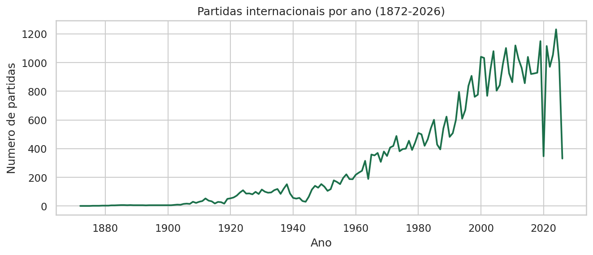
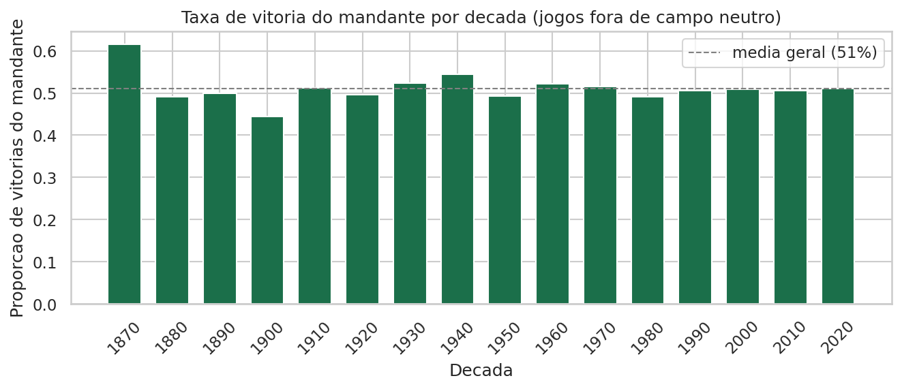
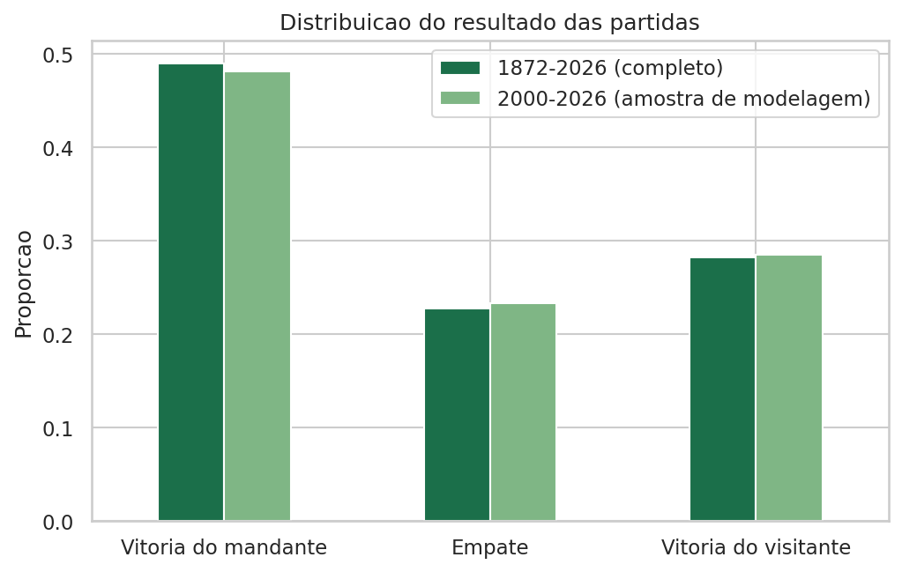
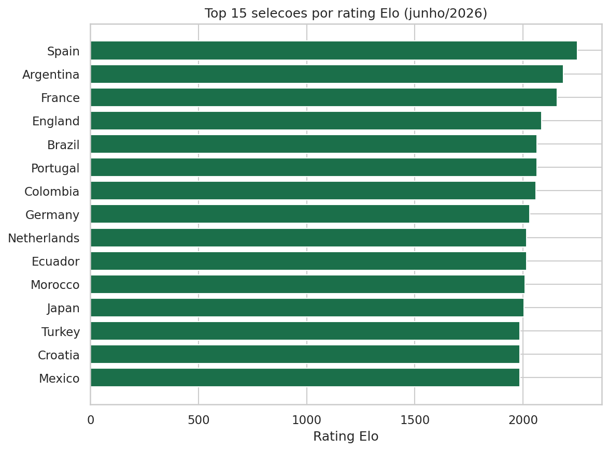
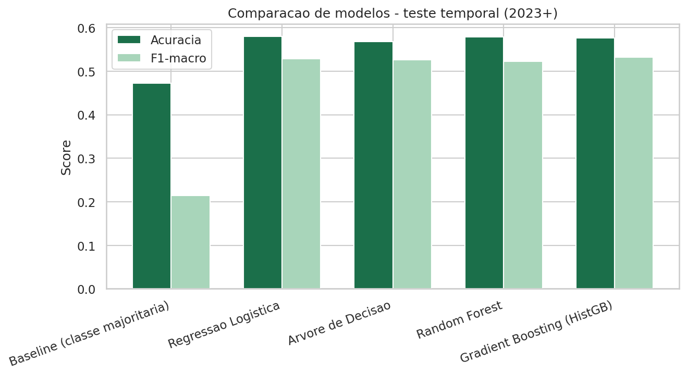
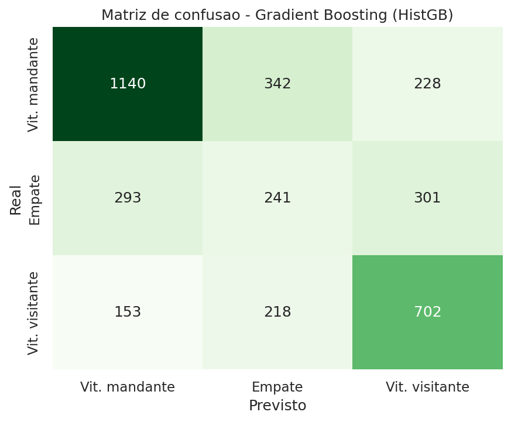

::: titlepage
UPF -- Universidade de Passo Fundo

**Previsão de Resultados de Partidas Internacionais de Futebol**

Um pipeline de Data Science aplicado ao dataset

*International Football Results (1872--2026)*

Murilo Kaemmerer Klein\
Guilherme Silveira Machado\
Samuel Vitor Zibetti

Passo Fundo -- RS\
2026
:::

# Resumo {#resumo .unnumbered}

Este relatório descreve o desenvolvimento de um projeto completo de Data
Science cujo objetivo é responder à pergunta: *é possível prever o
resultado de uma partida internacional de futebol (vitória do mandante,
empate ou vitória do visitante) a partir do histórico de desempenho das
seleções envolvidas?* Utilizando um dataset público com 49.425 partidas
internacionais disputadas entre 1872 e 2026, construímos features de
força das seleções (rating Elo calculado partida a partida), forma
recente e histórico de confrontos diretos, e comparamos cinco algoritmos
de classificação sob uma estratégia de validação temporal. O melhor
modelo (*Gradient Boosting*) atingiu 57,6% de acurácia e F1-macro de
0,532, superando claramente um baseline ingênuo (47,3% de acurácia,
F1-macro de 0,214). Os resultados são consistentes com a literatura
sobre previsão esportiva: o componente de aleatoriedade inerente ao
futebol limita a acurácia atingível mesmo por modelos de mercado
profissionais.

# Introdução

O futebol é o esporte mais praticado e assistido do mundo, e a previsão
de resultados de partidas é um problema de interesse tanto acadêmico
(modelagem estatística de eventos esportivos) quanto prático (mercados
de apostas, analítica esportiva, escalação de seleções). Diferentemente
de esportes com placares mais altos, o futebol tem poucos gols por
partida, o que torna o resultado mais sensível a fatores aleatórios (uma
bola na trave, um pênalti duvidoso, uma lesão de última hora) e,
consequentemente, mais difícil de prever de forma determinística.

O tema escolhido para este projeto é a **previsão de resultados de
partidas internacionais de futebol** (vitória do mandante, empate ou
vitória do visitante) a partir de características construídas sobre o
histórico de desempenho das seleções: força relativa (rating Elo), forma
recente e histórico de confrontos diretos entre as equipes.

## Relevância

Diferente de ligas de clubes, partidas de seleções nacionais têm uma
particularidade interessante para modelagem: o conjunto de \"times\" é
fixo e relativamente pequeno (poucas centenas de seleções reconhecidas
pela FIFA), os jogos são esparsos no tempo (em geral, poucas janelas
internacionais por ano), e há uma forte dependência de competições
oficiais (eliminatórias, Copas continentais, Copa do Mundo) que impõem
estrutura adicional aos dados. Isso torna o problema tecnicamente
interessante: o modelo precisa equilibrar sinal de longo prazo (força
histórica da seleção) com sinal de curto prazo (forma recente), e lidar
com classes desbalanceadas, já que empates são estatisticamente menos
frequentes que vitórias.

## Questões e hipóteses iniciais

O projeto foi guiado pelas seguintes questões, formuladas antes da
análise exploratória e testadas com os dados (Seção
[3](#sec:eda){reference-type="ref" reference="sec:eda"}):

1.  O número de partidas internacionais por ano cresceu substancialmente
    ao longo do tempo, refletindo a expansão e profissionalização do
    futebol internacional.

2.  Existe uma vantagem real de jogar em casa (mando de campo), que
    diminui quando a partida ocorre em campo neutro.

3.  Empates são a classe de resultado minoritária e, por isso, a mais
    difícil de prever.

4.  Um rating de força construído a partir do histórico de resultados
    (Elo) deve refletir o consenso atual sobre quais seleções são as
    mais fortes.

## Repositório do projeto

Todo o código-fonte, notebooks, dados e o dashboard interativo deste
projeto estão disponíveis publicamente em:

::: center
<https://github.com/muriloklein/trabalho_final_datascience>
:::

# Dataset

## Origem

Os dados utilizados são provenientes do dataset público [*International
football results from 1872 to
2026*](https://www.kaggle.com/datasets/martj42/international-football-results-from-1872-to-2017),
disponibilizado no Kaggle pelo usuário `martj42` e mantido a partir do
repositório
[`martj42/international_results`](https://github.com/martj42/international_results)
no GitHub, sob licença **CC0 1.0** (domínio público). O dataset é
atualizado continuamente; os dados utilizados neste trabalho foram
coletados em junho de 2026 e cobrem partidas até 16/06/2026.

## Estrutura e dicionário de variáveis

O arquivo principal (`results.csv`) contém uma linha por partida
internacional masculina, com as seguintes variáveis originais:

::: center
  **Variável**        **Descrição**
  ------------------- ---------------------------------------------------
  `date`              Data da partida
  `home_team`         Seleção mandante
  `away_team`         Seleção visitante
  `home_score`        Gols marcados pela seleção mandante
  `away_score`        Gols marcados pela seleção visitante
  `tournament`        Nome da competição (ex.: Copa do Mundo, amistoso)
  `city`, `country`   Local da partida
  `neutral`           Indica se a partida ocorreu em campo neutro
:::

Dois arquivos auxiliares também compõem o dataset: `shootouts.csv`
(vencedores de disputas de pênaltis em partidas empatadas no tempo
normal) e `former_names.csv` (referência de mudanças de nome de seleções
ao longo da história, como Alemanha Oriental/Ocidental $\rightarrow$
Alemanha).

Após a limpeza, o dataset contém **49.425 partidas** disputadas entre
30/11/1872 e 16/06/2026, envolvendo **336 seleções distintas**.

## Limpeza e transformações

As seguintes etapas de limpeza e preparação foram aplicadas
(implementadas em `src/data_prep.py`):

1.  **Remoção de partidas sem placar:** o dataset inclui partidas
    futuras já agendadas (por exemplo, jogos da fase de grupos da Copa
    do Mundo de 2026, em andamento no momento da coleta) sem resultado
    ainda registrado. Essas linhas foram removidas do conjunto de
    treino/teste, pois não possuem rótulo (variável-alvo) disponível.

2.  **Conversão de tipos e ordenação cronológica:** datas convertidas
    para o tipo apropriado e o dataset ordenado por data, um
    pré-requisito indispensável para qualquer cálculo de feature baseada
    em histórico (ver Seção [4.1](#sec:features){reference-type="ref"
    reference="sec:features"}).

3.  **Criação da variável-alvo (`outcome`):** categórica com três
    classes, derivada da diferença de gols (`home_score` $-$
    `away_score`): `home_win` (positiva), `draw` (zero) ou `away_win`
    (negativa).

4.  **Categorização do tipo de torneio:** o campo `tournament` original
    possui centenas de valores distintos (cada copa regional, cada
    edição de torneio amistoso etc.). Esses valores foram agrupados em
    seis categorias relevantes para a modelagem: *Friendly* (amistosos),
    *WC Qualifiers* (eliminatórias da Copa do Mundo), *Other Qualifiers*
    (outras eliminatórias), *World Cup* (Copa do Mundo),
    *Continental/Major* (Eurocopa, Copa América, Copa Africana de Nações
    etc.) e *Regional/Minor Cup* (torneios regionais menores).

5.  **Recorte da amostra de modelagem:** optamos por restringir o
    conjunto de *treino e teste* a partidas a partir do ano **2000**
    (25.363 partidas), evitando misturar a era moderna do futebol com
    períodos muito anteriores, em que o calendário de competições, o
    nível técnico e até as regras do jogo eram substancialmente
    diferentes. O histórico completo desde 1872, no entanto, é utilizado
    para *inicializar* o cálculo de features de longo prazo, como o
    rating Elo e o histórico de confrontos diretos (Seção
    [4.1](#sec:features){reference-type="ref"
    reference="sec:features"}).

# Análise Exploratória {#sec:eda}

A análise exploratória completa, com código e discussão célula a célula,
está disponível em `notebooks/01_EDA.ipynb`. Esta seção resume as
principais descobertas, organizadas em torno das hipóteses formuladas na
Introdução.

## H1: Crescimento do volume de partidas

<figure id="fig:matches_per_year" data-latex-placement="H">

<figcaption>Número de partidas internacionais por ano
(1872–2026).</figcaption>
</figure>

A Figura [1](#fig:matches_per_year){reference-type="ref"
reference="fig:matches_per_year"} **confirma a hipótese H1**: o volume
de partidas cresceu de poucas dezenas por ano no século XIX para mais de
mil partidas anuais na era recente, refletindo a expansão da FIFA e a
criação de competições regulares de eliminatórias. A queda visível em
2020 corresponde à pandemia de COVID-19, que cancelou ou postergou
diversas janelas internacionais de jogos.

## H2: Vantagem de jogar em casa

<figure id="fig:home_advantage" data-latex-placement="H">

<figcaption>Taxa de vitória do mandante por década, considerando apenas
partidas fora de campo neutro.</figcaption>
</figure>

A taxa de vitória do mandante em partidas fora de campo neutro é de
**50,7%**, contra apenas **44,2%** em partidas disputadas em campo
neutro, uma diferença de mais de 6 pontos percentuais que **confirma a
hipótese H2**. A vantagem de jogar em casa é real, persistente ao longo
das décadas (Figura [2](#fig:home_advantage){reference-type="ref"
reference="fig:home_advantage"}) e justifica a inclusão tanto do mando
de campo quanto da flag de campo neutro como features no modelo.

## H3: Desbalanceamento das classes

<figure id="fig:outcome_dist" data-latex-placement="H">

<figcaption>Distribuição do resultado das partidas (amostra de
modelagem, 2000–2026, comparada ao histórico completo).</figcaption>
</figure>

Na amostra de modelagem (partidas a partir de 2000), os resultados se
distribuem em **48,1% de vitórias do mandante**, **28,5% de vitórias do
visitante** e apenas **23,3% de empates**
(Figura [3](#fig:outcome_dist){reference-type="ref"
reference="fig:outcome_dist"}), **confirmando a hipótese H3**. Esse
desbalanceamento foi tratado na etapa de modelagem com a opção
`class_weight="balanced"` em todos os classificadores e com o uso da
métrica F1-macro (que pondera igualmente todas as classes) em vez de
apenas acurácia, evitando que o desempenho na classe minoritária seja
mascarado.

## H4: Validação do rating Elo

<figure id="fig:top15_elo" data-latex-placement="H">

<figcaption>Top 15 seleções por rating Elo calculado a partir dos dados
(estado em junho de 2026).</figcaption>
</figure>

O rating Elo construído a partir do histórico de resultados (metodologia
detalhada na Seção [4.1](#sec:features){reference-type="ref"
reference="sec:features"}) posiciona Espanha, Argentina, França,
Inglaterra e Brasil entre as cinco seleções mais fortes em junho de 2026
(Figura [4](#fig:top15_elo){reference-type="ref"
reference="fig:top15_elo"}), um ranking consistente com o consenso
público sobre as seleções mais competitivas do ciclo 2025--2026,
**confirmando a hipótese H4**. Isso indica que o rating capturou sinal
real de força das seleções, e não ruído, dando confiança para seu uso
como feature no modelo preditivo.

# Modelagem

## Engenharia de features {#sec:features}

Para que o modelo aprenda a prever resultados a partir de informação
genuinamente disponível *antes* de cada partida, todas as features foram
construídas com um cuidado metodológico central: **nenhuma feature pode
usar informação que só existiria depois da partida em questão ter sido
disputada** (vazamento temporal / *data leakage*). As features
implementadas (`src/features.py`) são:

- **Rating Elo** (`elo_diff`, `home_elo_pre`, `away_elo_pre`): calculado
  partida a partida, em ordem cronológica, desde 1872. O valor utilizado
  como feature é sempre o rating *antes* da atualização correspondente
  àquela partida. O fator $K$ (taxa de ajuste do rating) varia conforme
  a importância do torneio (de 15 para amistosos a 45 para Copa do
  Mundo), e um pequeno bônus de mando de campo (60 pontos) é aplicado
  apenas para o cálculo da probabilidade esperada de vitória, seguindo a
  mesma lógica do *World Football Elo Ratings*.

- **Forma recente** (taxa de vitórias e saldo de gols médio nas últimas
  5 e 10 partidas de cada seleção): calculada com uma operação de
  *shift* antes de qualquer agregação (*rolling*), garantindo que a
  partida atual nunca seja incluída no próprio cálculo de sua feature.

- **Histórico de confrontos diretos** (*head-to-head*): taxa histórica
  de vitórias do mandante especificamente contra aquele adversário,
  considerando apenas confrontos anteriores à data da partida.

- **Dias de descanso** desde o último jogo de cada seleção.

- **Categoria do torneio** e **campo neutro**, codificadas via *one-hot
  encoding* e variável binária, respectivamente.

## Modelos e justificativa

Foram comparados cinco modelos de classificação multiclasse (3 classes:
`home_win`, `draw`, `away_win`):

::: center
  **Modelo**                      **Justificativa da escolha**
  ------------------------------- --------------------------------------------------------
  Baseline (classe majoritária)   Referência mínima de comparação
  Regressão Logística             Modelo linear interpretável, baseline robusto
  Árvore de Decisão               Captura interações não-lineares simples, interpretável
  Random Forest                   *Ensemble* robusto a overfitting
  Gradient Boosting (*HistGB*)    Geralmente o mais competitivo em dados tabulares
:::

Todos os modelos (exceto o baseline) foram treinados com
`class_weight="balanced"` para compensar o desbalanceamento das classes
identificado na análise exploratória.

## Treinamento e validação

A divisão entre treino e teste foi feita de forma **temporal, e não
aleatória**: o conjunto de treino contém partidas até 2022 (21.745
partidas) e o conjunto de teste contém partidas de 2023 em diante (3.618
partidas). Essa escolha metodológica é central para a validade dos
resultados: uma divisão aleatória (por exemplo, k-fold tradicional)
misturaria partidas de diferentes épocas entre treino e teste,
permitindo que o modelo \"veja\" indiretamente informação do futuro ao
calcular features de forma recente e Elo para partidas do passado, além
de não refletir o uso real do modelo, que é sempre prever jogos futuros
a partir de dados estritamente anteriores.

# Resultados e Discussão

## Comparação de modelos

<figure id="fig:model_comparison" data-latex-placement="H">

<figcaption>Comparação de acurácia e F1-macro entre os modelos avaliados
no conjunto de teste (partidas de 2023 em diante).</figcaption>
</figure>

::: center
  **Modelo**                        **Acurácia**   **F1-macro**
  -------------------------------- -------------- --------------
  Baseline (classe majoritária)        47,3%          0,214
  Regressão Logística                  58,0%          0,528
  Árvore de Decisão                    56,8%          0,526
  Random Forest                        57,9%          0,523
  **Gradient Boosting (HistGB)**     **57,6%**      **0,532**
:::

Todos os modelos superam claramente o baseline: a acurácia sobe de 47,3%
para a faixa de 57--58%, e o F1-macro sobe de 0,214 para a faixa de
0,52--0,53. Um salto expressivo, já que o baseline ignora completamente
as classes minoritárias (empate e vitória do visitante), prevendo sempre
\"vitória do mandante\".

Entre os quatro modelos, a diferença de desempenho é pequena (no máximo
cerca de 1 ponto percentual de acurácia entre eles). Esse padrão é
esperado e consistente com a literatura sobre previsão de resultados
esportivos: o resultado de uma partida de futebol tem um componente de
aleatoriedade alto (lesões, decisões de arbitragem, um gol contra), e
mesmo casas de apostas profissionais, que têm acesso a muito mais
informação do que este projeto, incluindo escalações, lesões e o
consenso do mercado de apostas, raramente ultrapassam 55--60% de
acurácia em previsões de resultado (vitória/empate/derrota). O
**Gradient Boosting (HistGB)** foi selecionado como modelo final por
apresentar o melhor F1-macro, sendo o modelo utilizado no dashboard
interativo.

## Matriz de confusão e análise de erros

<figure id="fig:confusion_matrix" data-latex-placement="H">

<figcaption>Matriz de confusão do modelo final (Gradient Boosting) no
conjunto de teste.</figcaption>
</figure>

A matriz de confusão
(Figura [6](#fig:confusion_matrix){reference-type="ref"
reference="fig:confusion_matrix"}) confirma a hipótese H3 levantada na
análise exploratória: **empates são, de fato, a classe mais difícil de
prever**. O modelo atinge *recall* de 66,7% para vitórias do mandante e
65,4% para vitórias do visitante, mas apenas **28,9% de *recall* para
empates**, das 835 partidas que terminaram empatadas no conjunto de
teste, o modelo só identificou corretamente 241. Isso é consistente com
a natureza do problema: um empate frequentemente reflete um equilíbrio
momentâneo e específico daquela partida (não necessariamente um padrão
estrutural de longo prazo capturável a partir do histórico das equipes),
tornando-o estatisticamente mais próximo de um evento \"intermediário\"
entre as duas classes de vitória do que de uma categoria com identidade
própria e bem definida nos dados.

## Importância das features

A análise de importância de features (Random Forest, ver
`notebooks/02_modeling.ipynb`) mostra que a **diferença de rating Elo**
entre as seleções (`elo_diff`) é, isoladamente, a feature mais
importante do modelo, seguida pelos ratings absolutos de cada seleção e
pela taxa histórica de vitórias em confrontos diretos
(`h2h_home_win_rate`). Features de forma recente (últimos 5/10 jogos)
têm peso menor que o rating Elo, sugerindo que a força estrutural de
longo prazo de uma seleção é um preditor mais forte do que oscilações de
curto prazo em seus resultados mais recentes, um resultado que valida o
investimento feito na construção do rating Elo customizado, em vez de
usar apenas identificadores categóricos de time.

# Dashboard Interativo

Além do relatório escrito, foi desenvolvido um dashboard interativo em
**Streamlit** (`dashboard/app.py`), organizado em três seções:

1.  **Explorar dados:** filtros por período, categoria de torneio e
    seleção, com gráficos de distribuição de resultados e evolução do
    rating Elo de seleções específicas ao longo do tempo.

2.  **Prever uma partida:** permite ao usuário escolher duas seleções
    (ou selecionar diretamente um confronto real ainda não disputado da
    Copa do Mundo de 2026, presente no próprio dataset) e visualizar a
    probabilidade prevista pelo modelo para cada resultado possível.

3.  **Desempenho dos modelos:** apresenta a tabela comparativa de
    métricas e a matriz de confusão do melhor modelo.

Instruções para execução local do dashboard estão documentadas no
`README.md` do repositório.

# Conclusão

Este projeto desenvolveu um pipeline completo de Data Science para
prever resultados de partidas internacionais de futebol, cobrindo desde
a coleta e limpeza de dados até a modelagem, avaliação e comunicação
interativa dos resultados. As quatro hipóteses formuladas na etapa
exploratória foram confirmadas pelos dados: o futebol internacional
cresceu substancialmente em volume de partidas, existe uma vantagem real
(e mensurável) de jogar em casa, empates são a classe de resultado
minoritária e mais difícil de prever, e um rating de força construído
inteiramente a partir do histórico de resultados reproduz o consenso
atual sobre as seleções mais fortes do mundo.

O modelo final (Gradient Boosting) atingiu 57,6% de acurácia e F1-macro
de 0,532 em um conjunto de teste temporal rigoroso, superando
substancialmente o baseline ingênuo. O ganho mais consistente, porém,
não veio da escolha do algoritmo, a diferença entre os quatro modelos
não-triviais foi pequena e sim da **engenharia de features**, em
especial do rating Elo customizado, que se mostrou a variável mais
informativa do modelo.

## Limitações

O modelo desenvolvido não incorpora diversas informações que tipicamente
melhoram a previsão de resultados esportivos: escalações e lesões de
jogadores-chave, contexto tático (mudanças de técnico, esquema de jogo)
e odds de mercado de apostas (que agregam informação privilegiada de
milhares de apostadores). Além disso, a restrição da amostra de
modelagem a partidas a partir do ano 2000, embora justificada
metodologicamente, implica que o modelo não foi avaliado sobre a
totalidade do histórico disponível.

## Trabalhos futuros

Como extensões naturais deste trabalho, sugerimos: (i) incorporar dados
de escalação e ausência de jogadores-chave, quando disponíveis; (ii)
testar pesos de decaimento temporal nas features de forma recente, dando
menos peso a jogos mais antigos dentro da própria janela; (iii) explorar
um modelo de regressão para o placar exato (em vez de apenas o
resultado), permitindo estimar probabilidades de múltiplos mercados
(under/over, ambas marcam, etc.); e (iv) comparar o desempenho do modelo
contra odds reais de casas de apostas, como benchmark externo de
qualidade.

# Apêndice: Reprodutibilidade {#apêndice-reprodutibilidade .unnumbered}

Todo o pipeline (limpeza, engenharia de features, treino e avaliação dos
modelos) é executado por um único script (`run_pipeline.py`) e foi
validado de forma totalmente reprodutível a partir dos dados brutos. As
instruções completas de instalação e execução, incluindo como rodar o
dashboard localmente, estão documentadas no arquivo `README.md` do
repositório do projeto.
